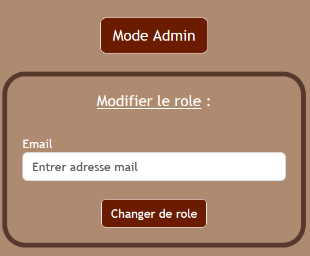

# ECF - Studi : QUAI ANTIQUE 

### <u>Somaire</u> :
<a href="#Description"> Description du projet </a> <br>
<a href="#Organisation"> Organisation du projet </a> <br>
<a href="#Installer"> Installer/ Executer le projet </a> <br>
<a href="#Admin"> Creer un compte admin </a>

## <div id="Description">Description du projet :</div>

Ce projet est un site web pour le troisieme `restaurant`, specialise dans les produits de la Savoie, du `Chef Arnaud Michant`. Ce restaurant est situe a `Chambery`.

Pour cela le `Chef Arnaud Michant`, nous a demande de faire un site web avec certaines fonctionnalites. 

Date de rendu final : `20/07/2023`

## <div id="Organisation">Organisation du projet :</div>

#### Les fichiers sont repartis en 6 dossiers :
 - <u>assets</u> : dossier regroupant les `images generales` du projet. <br> (ex: logo, image pour le readme, ...)
 - <u>documents</u> : dossier regroupant les documents a rendre.<br>
 - <u>img</u> : dossier regroupant les images pour la `galerie d'image`.
 - <u>mysql</u> : dossier regroupant 2 fichiers, la `database` et `connect.php`. <br>(fichier utile a la connexion avec la database)
 - <u>php-pages</u> : dossier regroupant toute les `pages php`.
 - <u>stylesheets</u> : dossier regroupant tout les `fichiers css`.

 seul `index.php`, page principale, et `README.MD` sont hors de ces dossiers.

## <div id="Installer">Installer et executer le projet :</div>

### Installation du projet :

```
git clone https://github.com/SoleneMend/ECF-Studi-QuaiAntique.git
```

### Executer le projet : 
#### Sous Xampp :

Sur votre page 'http://localhost/phpmyadmin' implementer la base de donnees nommee `database.sql` se trouvant dans le ficher `mysql`

Deposer le fichier du projet dans `xampp\htdocs\nom-de-votre-fichier`

Maintenant vous pouvez aller sur 'http://localhost/nom-de-votre-fichier' ou 'http://localhost/nom-de-votre-fichier/index.php'

<br>

## <div id="Admin">Creer un compte admin :</div>

Pour creer un `compte admin`, il faut en premier lieu creer un `compte utilisateur`. <br>
Ensuite un `administrateur` pourra changer votre role <br>
(L'inverse est possible aussi) <br>

Pour l'administrateur : <br>
Il faudra simplement aller sur son compte pour avoir acces au `menu d'administation` ou `changer le role de quelqu'un` (voir image) <br>

